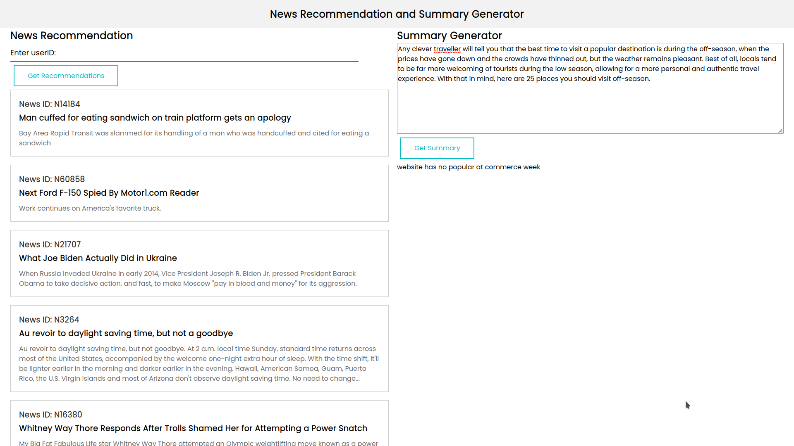

# News Recommendation System and Summary Generator

This is a Flask project that implements a news recommendation system and a text summarization feature using Neural Collaborative Filtering and Transformer Model.

## Screenshots



## Installation

1. Clone the repository:

    ```bash
    git clone https://github.com/uppercasee/recNsum.git
    cd recNsum
    ```

2. Create a virtual environment:

    ```bash
    python3 -m venv venv
    ```

3. Activate the virtual environment:

    - On Windows:

        ```bash
        venv\Scripts\activate
        ```

    - On macOS and Linux:

        ```bash
        source venv/bin/activate
        ```

4. Install dependencies:

    ```bash
    pip install -r requirements.txt
    ```

## Usage

1. Run the Flask application:

    ```bash
    python app.py
    ```

2. Once the server is running, visit [http://127.0.0.1:5000/](http://127.0.0.1:5000/) in your web browser.

3. You will be presented with a form where you can input text for summary generation and provide a user ID for news recommendation.

4. Click on the "Generate Summary" button to generate a summary for the provided text.

5. To receive news recommendations, enter a user ID and click on the "Recommend News" button. This will display news articles with their IDs, titles, and abstracts.

<!-- ## Contributors

- [Your Name](https://github.com/yourusername) -->

## License

This project is licensed under the [MIT License](LICENSE).
